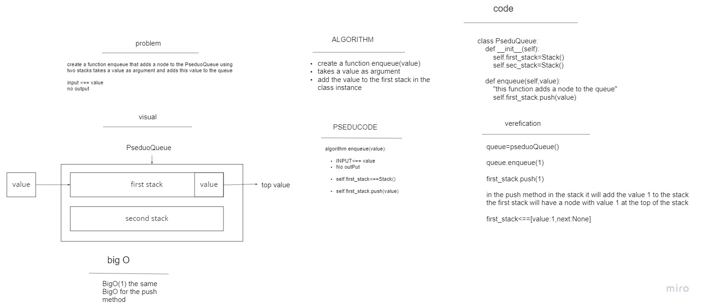
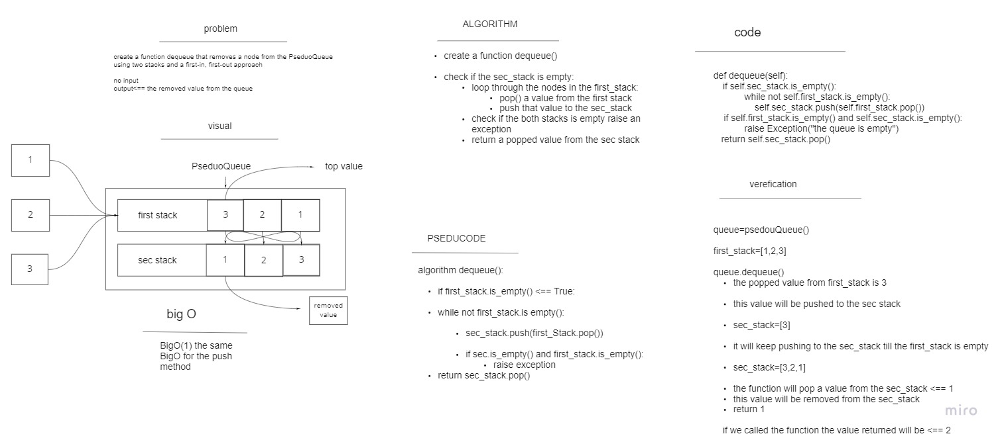

# Stacks and Queues

- this is an Implementation for Stacks and Queues data structure

- Stack: A stack is a data structure that consists of Nodes. Each Node references the next Node in the stack,     but does not reference its previous.

- Queue: Queues follow these concepts:

1. FIFO
First In First Out

This means that the first item in the queue will be the first item out of the queue.

2. LILO
Last In Last Out

This means that the last item in the queue will be the last item out of the queue.

## BigO --> Stack

| Operation Names | Big O |descreption|
| ----------- | ----------- |---------|
| push | O(1) |adds a new node with that value to the top of the stack|
| pop | O(1) |1.  Returns: the value from node from the top of the stack 2. Removes the node from the top of the stack|
| peek | O(1) | Returns: Value of the node located at the top of the stack|
|is_empty| O(1)|returns a boolean True if the stack is empty False if Not |

## Big0 --> Queue

| Operation Names | Big O |descreption|
| ----------- | ----------- |-----------|
| enqueue | O(1) |adds a new node to the back of the queue|
| dequeue | O(1) |1.  Returns: the value from node from the front of the queue 2. Removes the node from the front of the queue|
| peek | O(1) | Returns: Value of the node located at the front of the queue|
|size|O(n)|  return an integer with the number of nodes in the queue|
|is_empty| O(1)| Returns: Boolean indicating whether or not the queue is empty|

# pseduo_queue:

- Implementation for a queue using two stacks from the stack class

## Pseduo queue methods:

1. enqueue:
this function adds a node to the queue using a first-in, first-out approach

2. dequeue 
this function removes the node located at the front of the queue which is the top value for the sec stack using a first-in, first-out approach

