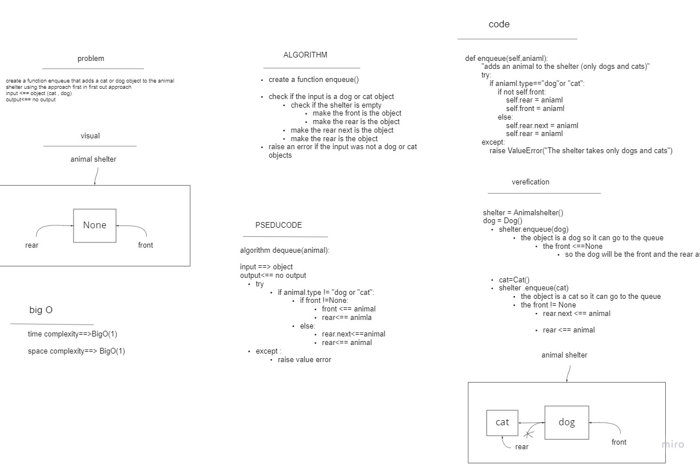
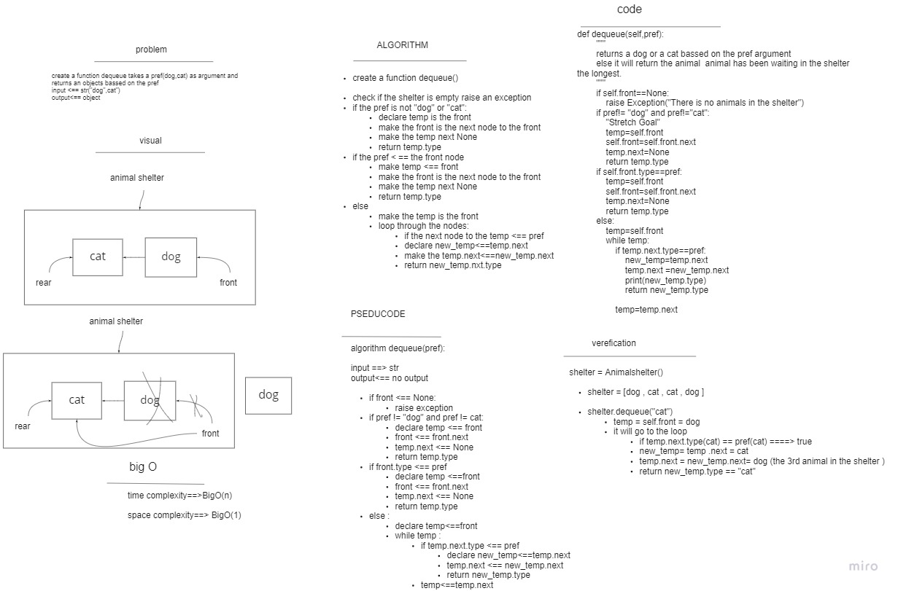

# Animal Shelter

- this class holds only dogs and cats objects and operates using a first-in, first-out approach.

## animal shelter functions 

### 1. enqueue

- this function adds an animal only (dogs,cats) to the shelter with BigO(1)

### 2. dequeue 

- this function returns an animal from the shelter bassed on pref (dog , cat)

