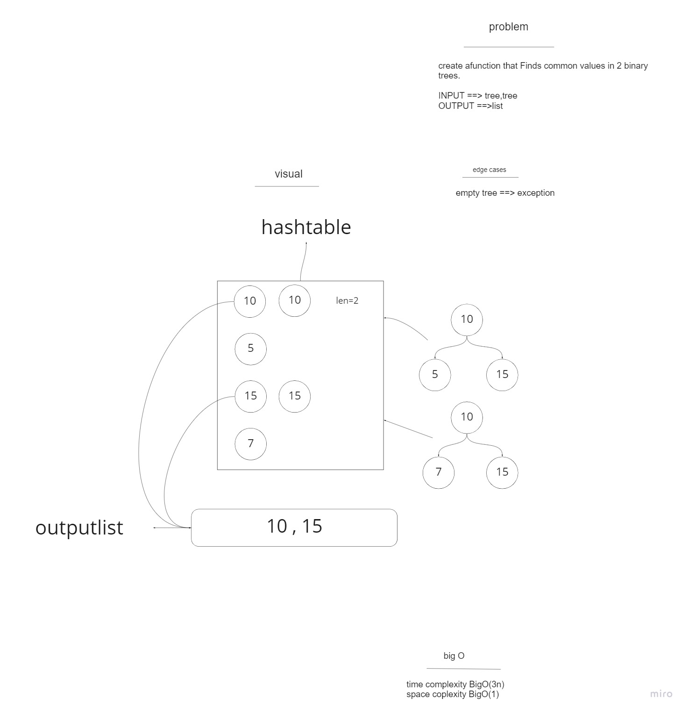
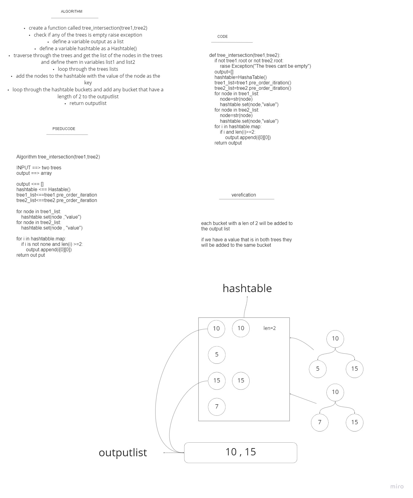

# tree-intersection

this function takes two trees as argument  returns a set of values found in both trees., using your Hashmap implementation

input ===> tree , tree
output ===> array


example:


```
Output:

100,160,125,175,200,350,500
```

# whiteboard



