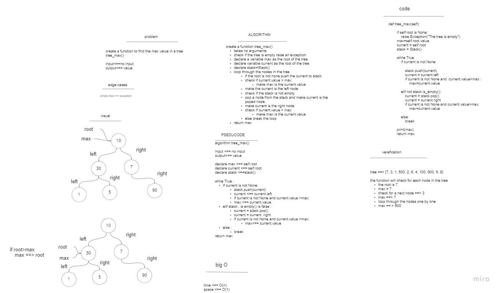

# Trees 

## Common Terminology

- Node - A Tree node is a component which may contain its own values, and references to other nodes
- Root - The root is the node at the beginning of the tree
- K - A number that specifies the maximum number of children any node may have in a k-ary tree. In a binary tree, - k = 2.
- Left - A reference to one child node, in a binary tree
- R- ight - A reference to the other child node, in a binary tree

## methods

- traversals:

1.  pre order:
traverse the tree in order :
BigO(n)w
root >> left >> right
 
2. in order:
traverse the tree in order :
BigO(n)
left >> root >> right

3. post order 
traverse the tree in order :
BigO(n)
left >> right >> root

- add method 
this unction Adds a new node in the correct location in the binary search tree.
BigO(log2n)

- contains 
this function returns a boolean  whether or not the value is in the tree at least once.
BigO(log2n)

- tree max :
this function return the maximum value in the tree 
 BigO(n)

