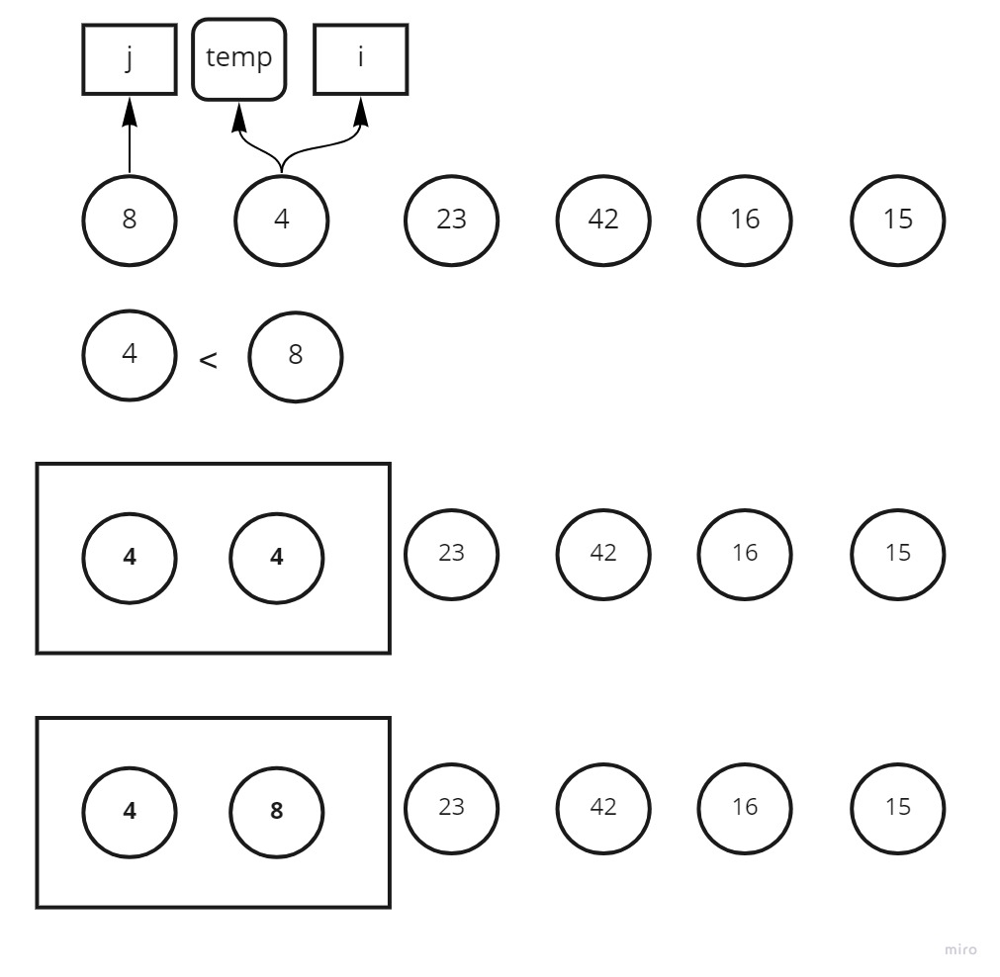
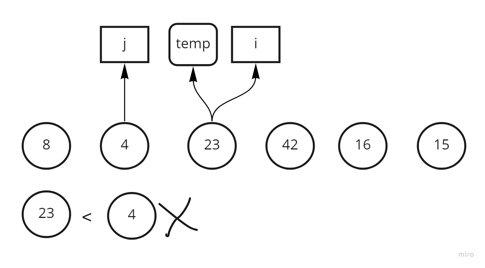
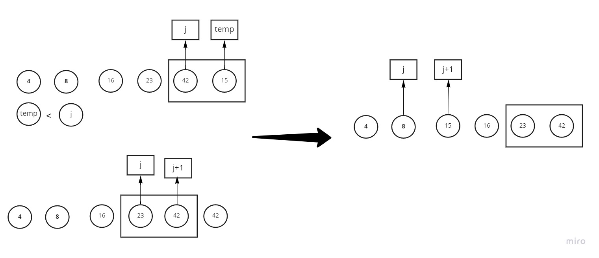

# insertion sort

insertion Sort is a sorting algorithm that traverses the array multiple times as it slowly builds out the sorting sequence. 

## Pseudocode
```
InsertionSort(int[] arr)

    FOR i = 1 to arr.length

      int j <-- i - 1
      int temp <-- arr[i]

      WHILE j >= 0 AND temp < arr[j]
        arr[j + 1] <-- arr[j]
        j <-- j - 1

      arr[j + 1] <-- temp
```

## Trace

- sample:

 [8,4,23,42,16,15]


1.  

    - first we check if the temp value is smaller than arr[j]

        - we switch between the value at j+1 and j 

    - result [4,8,23,42,16,15]

2. 

    - nothing will in the next two steps  since the temp value is bigger than arr[j]

    - result [4,8,23,42,16,15]

3. .jpg)

    - at this step the temp is less than 42 and less than 23 so it will make two steps until j reachs 8.

    1. 16 --> 42 
    2. 42 --> 23  / 23 --> 16 

    - result [4,8,16,23,42,15]


4. 

    - finally temp now is 15 so it needs 3 steps to reach 8.

    1.  15 --> 42 
    2.  42 --> 23
    3.  23 --> 16 / 16 --> 15 

    - ## result [4,8,15,16,23,42]

Efficency:

Time: O(n^2)

Space: O(1)


    
    


