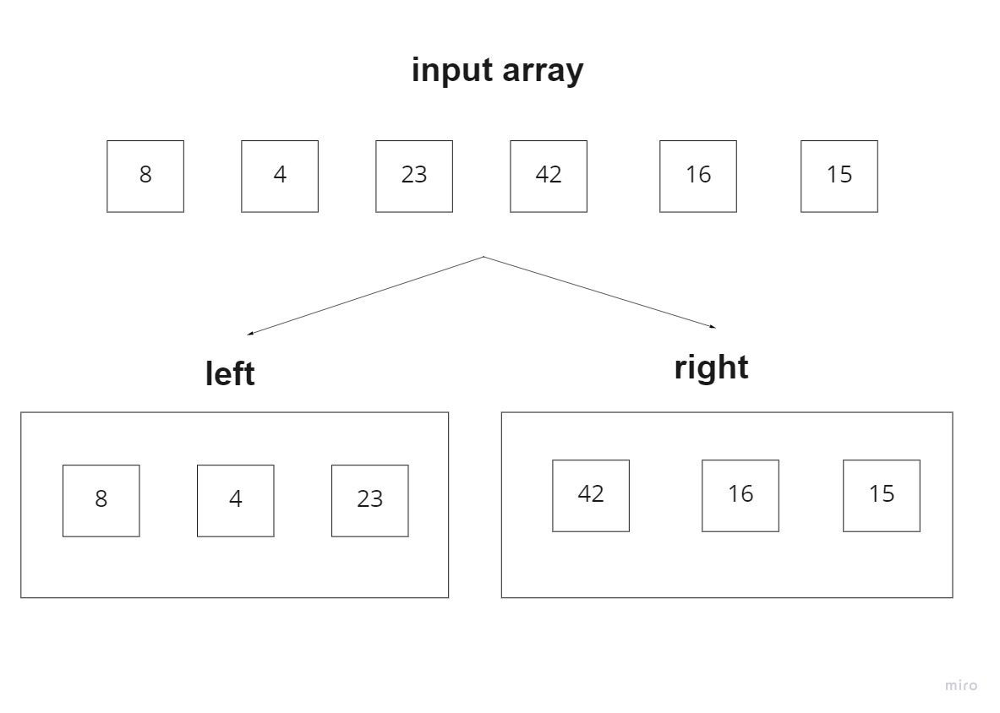
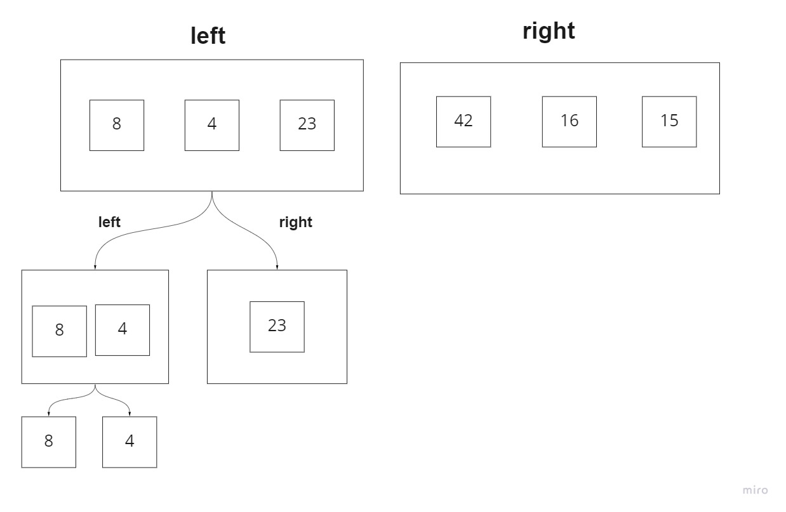
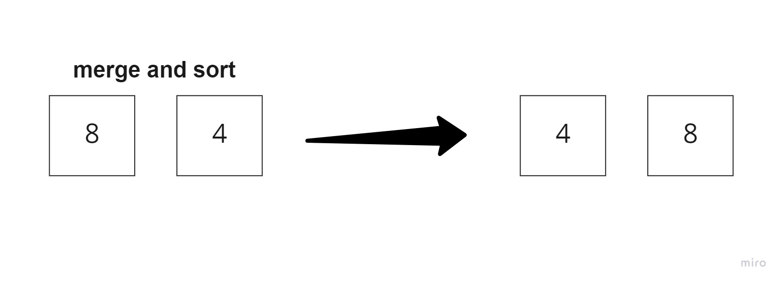
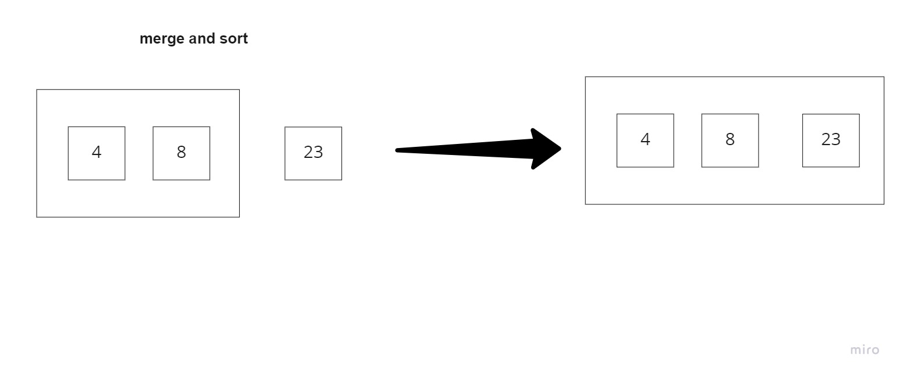
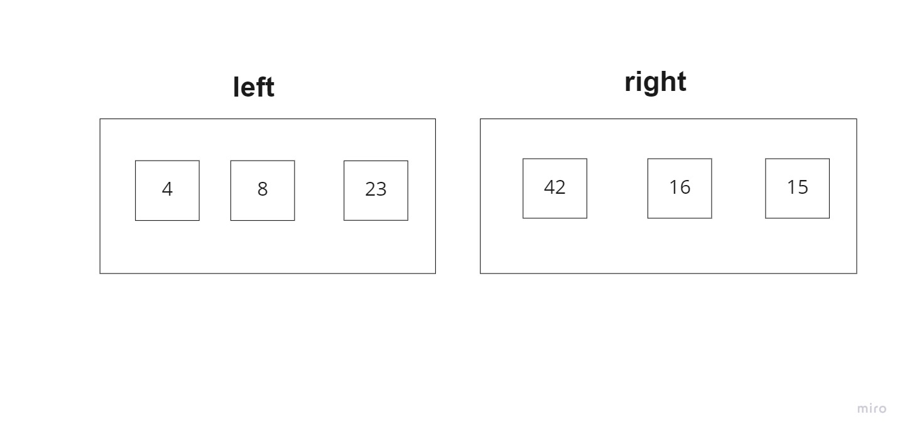
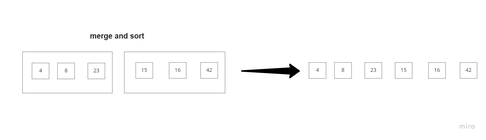

# merge_sort

## Sample Arrays

[8,4,23,42,16,15]

## Trace 

1. first we will split the array into two halves (left and right).

2. we still have in each side more than one element , so we will keep spliting untill we have each element as right or left.

2. now we will merge the left and the right and sort them.

3. further merge and sort the left with right at the split before.

4. now we have the first half sorted we will repeat the same steps for the second half.

5. when we have the two halfes sorted we will mrge and sort them.

