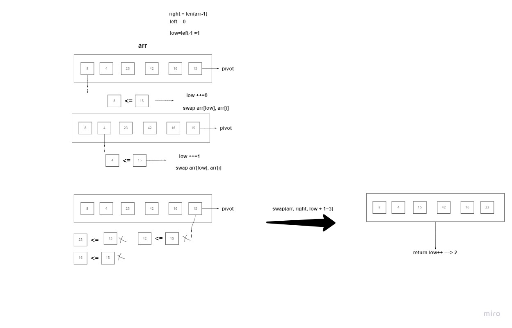
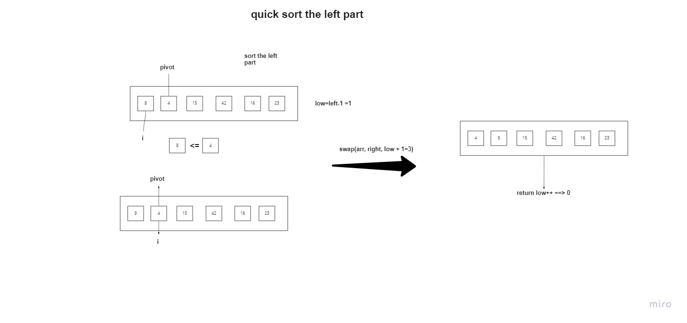
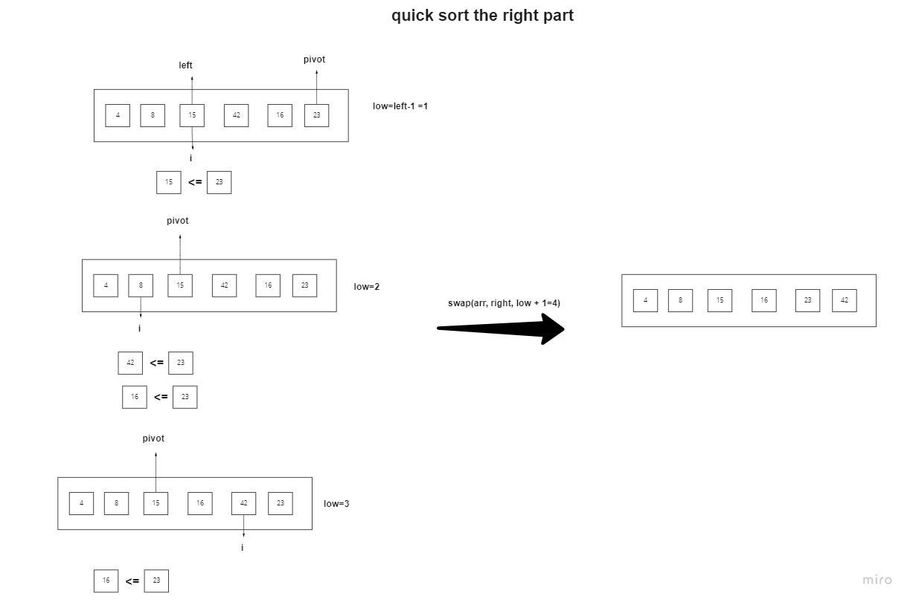

# QuickSort 

QuickSort is a Divide and Conquer algorithm. It picks an element as pivot and partitions the given array around the picked pivot.


## pseudo code

```
ALGORITHM QuickSort(arr, left, right)
    if left < right
        // Partition the array by setting the position of the pivot value
        DEFINE position <-- Partition(arr, left, right)
        // Sort the left
        QuickSort(arr, left, position - 1)
        // Sort the right
        QuickSort(arr, position + 1, right)

ALGORITHM Partition(arr, left, right)
    // set a pivot value as a point of reference
    DEFINE pivot <-- arr[right]
    // create a variable to track the largest index of numbers lower than the defined pivot
    DEFINE low <-- left - 1
    for i <- left to right do
        if arr[i] <= pivot
            low++
            Swap(arr, i, low)

     // place the value of the pivot location in the middle.
     // all numbers smaller than the pivot are on the left, larger on the right.
     Swap(arr, right, low + 1)
    // return the pivot index point
     return low + 1

ALGORITHM Swap(arr, i, low)
    DEFINE temp;
    temp <-- arr[i]
    arr[i] <-- arr[low]
    arr[low] <-- temp
```

## Trace

- partition the array around the pivot

1. first we pick the pivot as the last element in the array
2. we create a variable to track the largest index of numbers lower than the defined pivot
3. we loop through the array and compare each element to the pivot.
4. if the element is lower than the pivot, we increment the low variable and swap the element with the element at the low index.
5. we swap the pivot with the element at the low index.
6. we return the pivot index point




- sort the left side of the array , at the new pivot index

1. repeat the process on the left side of the array




- sort the right side of the array, at the new pivot index

1. repeat the process on the right side of the array



