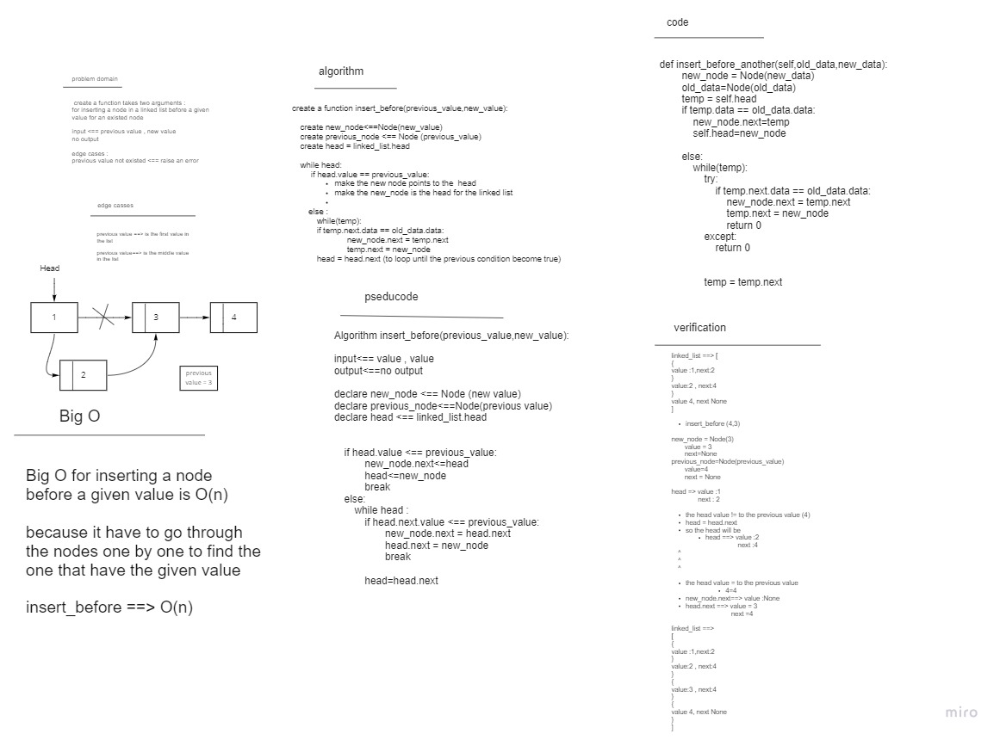
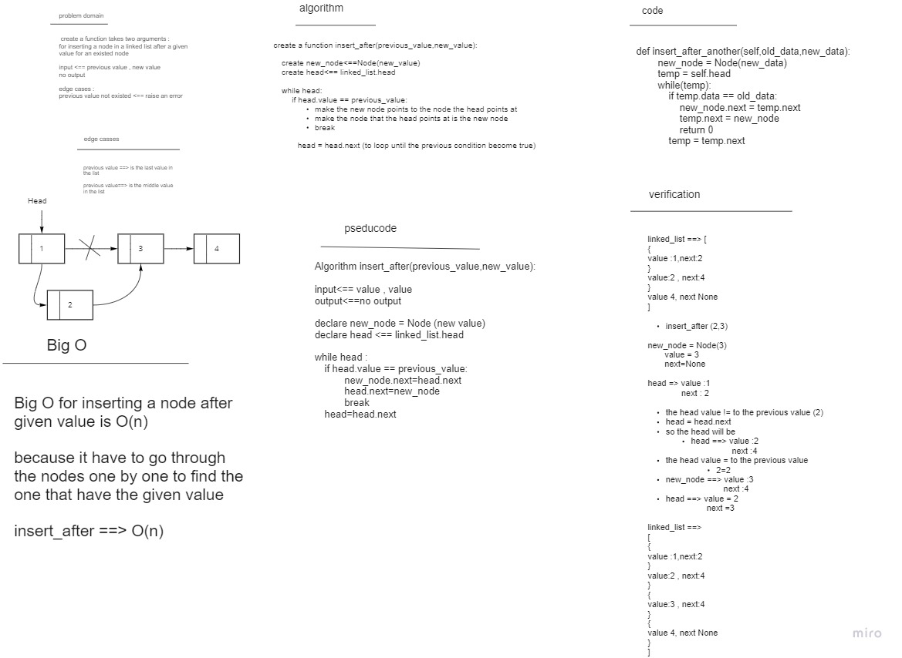
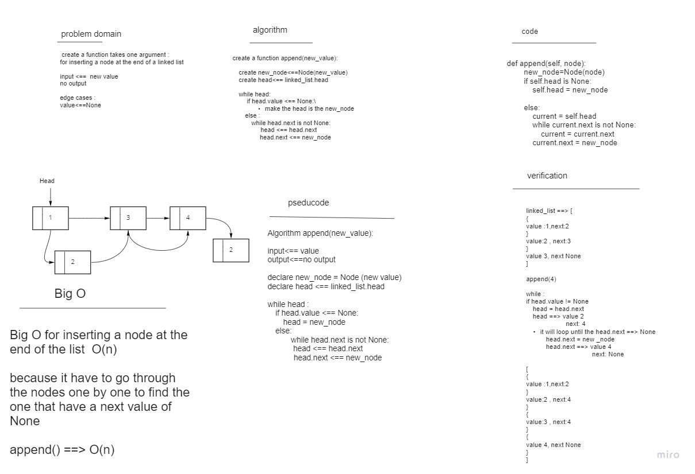
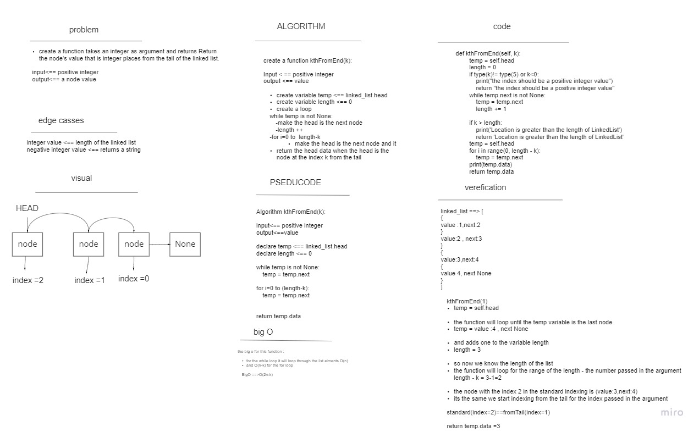
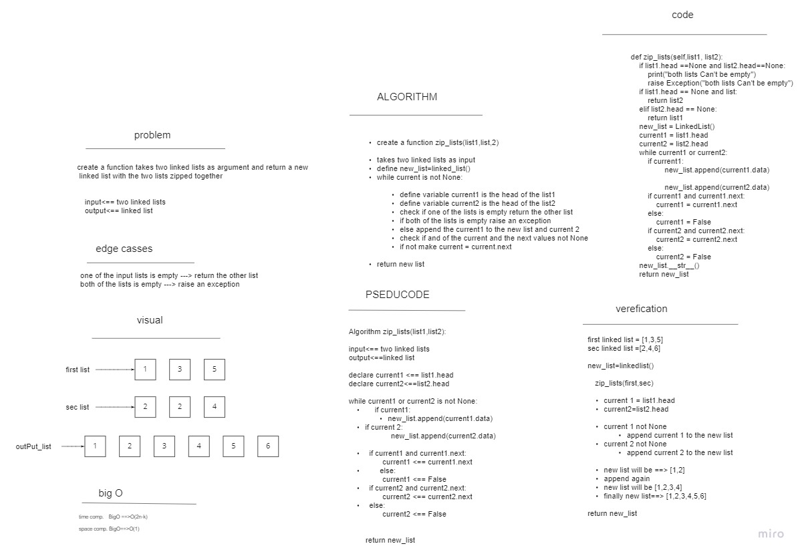

# Singly Linked List

*this is an Implementation for a Singly Linked List in python*

## Big O Complexity For Operations On Singly Linked List:

| Operation Names | Big O |
| ----------- | ----------- |
| insert | O(1) |
| includes | O(N) |
| str | O(N) |
|insert_after| O(n)|
|insert_before|O(n)|
|append|O(n)|
|KthFromEnd|O(n-k)|

-  ## class Node : 

has properties for the "value" stored in the Node, and a pointer to the "next" Node.

- ## class Linked_List:
includes a head property

methodes: 
1. insert : takes a value as argument , Adds a new node with that value to the head of the list with an O(1) Time performance.

2. includes:  takes a value as argument ,Indicates whether that value exists as a Node’s value somewhere within the list.

3. *__str__*: 
Returns: a string representing all the values in the Linked List, formatted as:
"{ a } -> { b } -> { c } -> NULL"

## whiteboard

### insert before
- insert a node before a given value for a node

## insert after 
- insert a node after a given value for a node 

## append 

- adds a node to the end of the lest 

## KthFromEnd:

- return a node with the index of an integer from the back of the linked list 

## zip_lists
-  takes two list as input and returns a new list of the two list zipped together 

